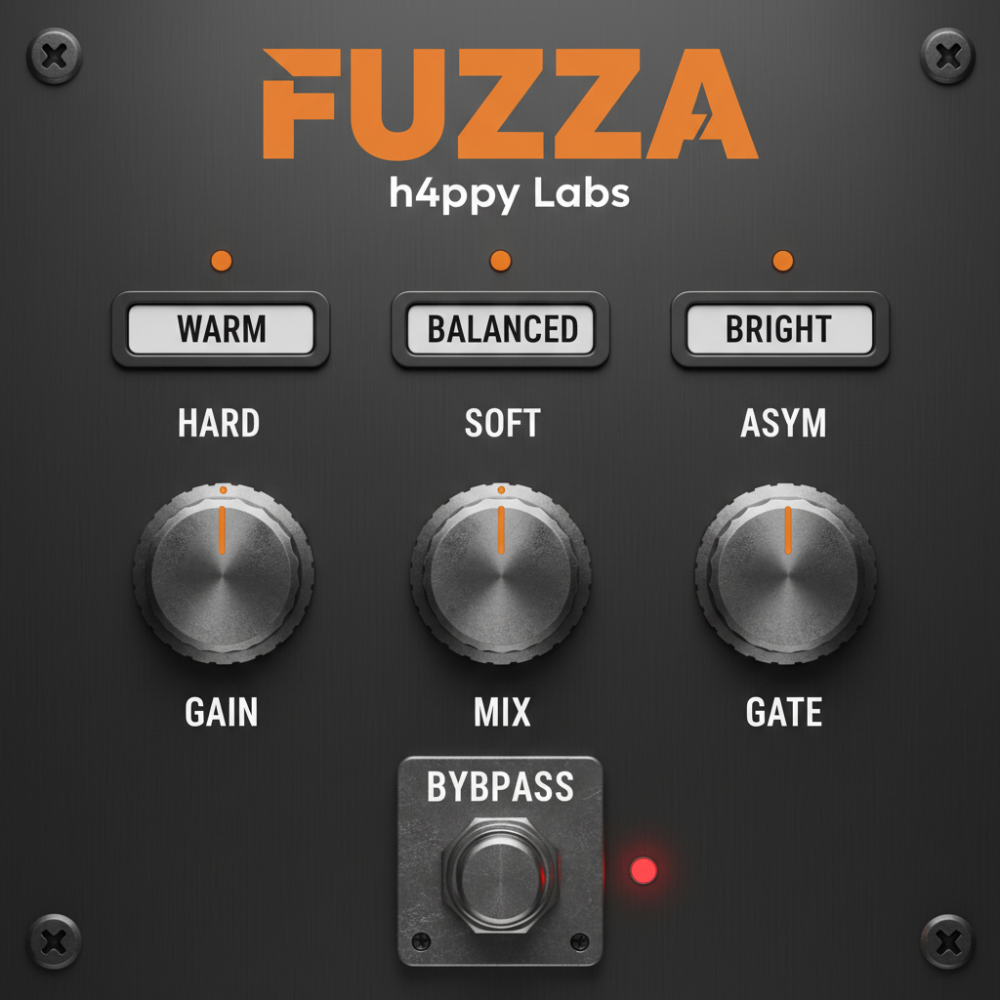

# Fuzza VST

JUCE와 CMake로 제작된 일렉트릭 기타용 Fuzz 디스토션 플러그인입니다.




## 주요 기능

### 컨트롤 (3개 노브 + 6개 버튼)

#### 노브 (Knobs)
- **Gain (0-100)**: Fuzz 디스토션의 양을 조절합니다
  - **0**: 클린 부스트 모드 (+6dB, 디스토션 없음)
  - **1-50**: 빈티지 퍼즈 사운드 (중간 디스토션)
  - **50-100**: 모던/극한 퍼즈 사운드 (강한 디스토션)
  - **자동 레벨 보상**: Gain이 높아져도 출력 레벨이 일정하게 유지됩니다

- **Mix (0-100%)**: 원음과 퍼즈 신호의 블렌드 비율 (Dry/Wet)
  - **0%**: 완전한 원음 (이펙트 없음)
  - **50%**: 원음과 퍼즈 50:50 블렌드 (Parallel Processing)
  - **100%**: 완전한 퍼즈 사운드 (기본값)

- **Gate (0-100%)**: 노이즈 게이트 강도
  - **0%**: 게이트 꺼짐 (기본값)
  - **1-30%**: 부드러운 노이즈 제거 (Dual-Stage)
  - **30-100%**: 강한 게이트 (스타카토 효과)
  - **Dual-Stage System**: 입력단(Input Gate)과 출력단(Output Suppressor)이 동시에 작동하여 서스테인을 유지하며 노이즈를 제거합니다.

#### Tone 프리셋 (Preset Buttons)
- **WARM** (800Hz): 어둡고 두꺼운 톤 - 리듬 기타, 블루스
- **BALANCED** (2000Hz): 균형잡힌 만능 톤 - 기본값
- **BRIGHT** (4500Hz): 밝고 날카로운 톤 - 솔로, 리드

#### Clipping 모드 (Mode Buttons)
- **HARD**: 클래식 하드 클리핑 - 공격적인 퍼즈 (기본값)
- **SOFT**: 부드러운 tanh 클리핑 - 따뜻한 튜브 사운드
- **ASYM**: 비대칭 클리핑 - 빈티지 캐릭터

#### Bypass Footswitch
- 하단 중앙의 페달 스타일 버튼 (트루 바이패스)
- 빨간색 = Bypassed (이펙트 꺼짐)

### 기술적 특징
- **Multiple Clipping Algorithms**: Hard/Soft/Asymmetric 클리핑
- **Parallel Processing**: Mix 컨트롤을 통한 Dry/Wet 블렌딩
- **Dual-Stage Noise Reduction**:
  - **Input Gate**: 빠른 Attack/Release로 소스 노이즈 차단
  - **Output Suppressor**: 부드러운 감쇠로 서스테인 유지 및 하이게인 노이즈 억제
- **Low-Pass Tone Filter**: JUCE DSP 기반 고품질 필터
- **Auto-Level Compensation**: sqrt 기반 자동 레벨 조정
- **Professional Pedal-Style GUI**: 실제 하드웨어 페달 같은 UI
- **Zero Latency**: 실시간 처리, 지연 없음

## 빌드 방법

### 필수 요구 사항
- CMake 3.15 이상
- C++ 컴파일러 (Clang, GCC, 또는 MSVC)
- [JUCE](https://github.com/juce-framework/JUCE) (CMake를 통해 자동으로 다운로드됩니다)

### 빌드 단계

1. **설정 (Configure)**:
   ```bash
   cmake -B build
   ```

2. **빌드 (Build)**:
   ```bash
   cmake --build build
   ```

빌드된 플러그인은 자동으로 시스템 폴더에 설치됩니다.

## 설치 방법

빌드 후 플러그인이 자동으로 설치되는 경로:
- **macOS VST3**: `~/Library/Audio/Plug-Ins/VST3/Fuzza.vst3`
- **macOS AU**: `~/Library/Audio/Plug-Ins/Components/Fuzza.component`
- **Windows VST3**: `C:\Program Files\Common Files\VST3\Fuzza.vst3`
- **Standalone**: `build/Fuzza_artefacts/Standalone/`

## 지원 플랫폼
- macOS (VST3, AU, Standalone)
- Windows (VST3, Standalone)

## 버전 히스토리
자세한 변경 사항은 [CHANGELOG.md](CHANGELOG.md)를 참조하세요.

## 라이선스
MIT
